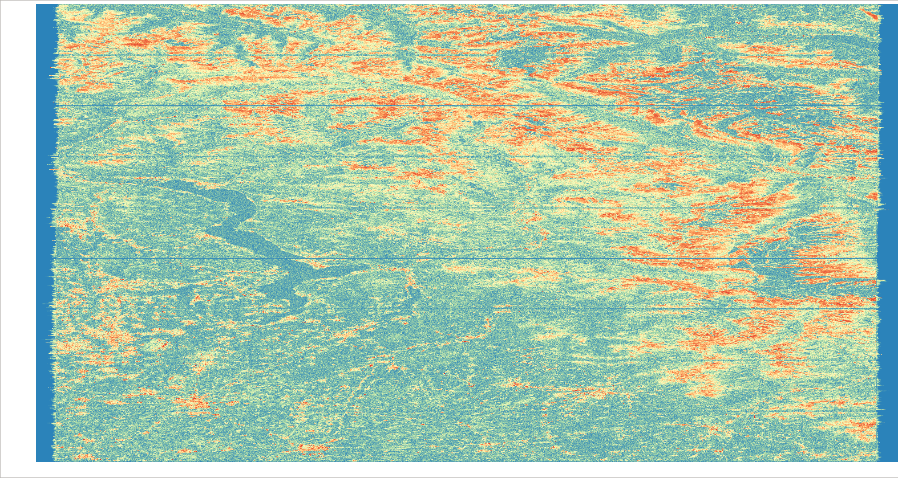

# Main steps to convert to linux

This repository is a fork of [Yanghai Yu's CUDA code for
InSAR processing of Sentinel-1 SLC data](https://github.com/a787854/InSAR-on-Sentinel-1-TOPS-data)
and contains the POSIX compliant C++ code to run on linux (the original code is for Windows Visual Studio C++).

To understand what the code does, make sure to read the excellent paper:

[GPU accelerated interferometric SAR processing for Sentinel-1 TOPS data" (2019), Computers and Geosciences](https://doi.org/10.1016/j.cageo.2019.04.010).

Only minimum changes have been made to the original C++ code (documented below)
and primarily related to different file reading of metadata, which is different
for Windows based C++ (which is not POSIX compliant).

The main benefit of the converted code is that **it can run on linux**.

No changes were made to the CUDA code (\*.cu code fragments).

## Test Configurations

The code was tested on a HP Pavilion laptop with:
- Intel(R) Core(TM) i7-1065G7 CPU @ 1.30GHz x8
- 16 GB RAM
- GeForce MX250 with 2GB onboard RAM (384 cores)
- Ubuntu 18.04.5 LTS

The GeForce MX250 is CUDA compute 6.0 compatible.

The code was also deployed on an [AWS p3.2xlarge](https://aws.amazon.com/ec2/instance-types/p3/) cloud instance with:
- Intel Xeon E5-2686 v4 x8
- 64 GB RAM
- V100 Tesla with 16 GB onboard RAM (5120 cores)
- Ubuntu 18.04.5 LTS

The V100 is CUDA compute 7.0 compatible.

The code processes a Sentinel-1 SLC pair to full resolution coherence for a selection
of subswaths and bursts. However, several steps are not yet included, in particular debursting and subswath merging and, more importantly, terrain correction.

The pseudo-colored coherence output for subswath is shown below. This is for the
S1A pair in [the test configuration file](config.txt), which is a descending
scene over Northern Italy. Lake Maggiore is in the left half of the scene
(east-west is mirrored, because Sentinel-1 is right looking). Note that the burst
boundaries are still visible.



The full scene (3 subswaths with 9 bursts each) is processed
in about [3 minutes on the laptop configuration](mx250_run.log) above.

That's **impressive** if compared
to the [ESA SNAP Sentinel-1 toolbox](https://github.com/senbox-org/s1tbx) based
coherence processing, even though a full performance comparison is not yet
possible, due to the missing steps.

In fact, it is so fast that the process is no longer compute constrained, but rather
limited by I/O throughput. The 3 minutes performance is when data read/write is
from/to an SSD. The same run takes 7 minutes if the data read/write is from/to HDD.
About 8 GB input is read and 20 GB of output is created.

This is confirmed further by the [AWS p3 run, which takes 1m44s](v100_run.log).
Individual CUDA accelerated processing steps are easily 10 times faster than the
equivalent steps on the mx250, but the overall process is only twice as fast.

## Requirements

### Install tinyxmls2 and gdal dependencies
```
sudo apt-get install libtinyxml2-6 libtinyxml2-dev
sudo apt-get install libgdal20 libgdal-dev
```

### Install CUDA toolkit

Provides the nvcc compiler, relevant numerical libraries and the required header
cuComplex.h

```
sudo apt install nvidia-cuda-toolkit
```

## Compile and run

Make sure to have recent g++ and nvcc compilers installed. The test box uses g++ 7.5.0
and nvcc 9.1.

Check whether code header include and linked library directories are set correctly
for compiling and linking (if not, this will throw errors that are usually self-evident)

A [Makefile](Makefile) is included.

Check your GPU compute compatibility and change the -arch=sm_NN CUDAFLAG accordingly.
(NN must be >= 30).

Compile with:

```
make all
```
Run with:

```
./gpuSNAP
```

**NOTE**: I need to exit X windows on my mx250 laptop (Ctrl-Alt-F1 or sudo init 3) due to GPU
computing conflicts (likely memory related). When using a GeForce GPU, you cannot
switch to TCC mode (on linux). Just login normally, and run everything from the command line.

## Code changes (C++ only):

All CRLF converted to LF (inherited from Windoze). Essential for input files, e.g.
config.txt. If config file is not converted, string concatenation (e.g. in GetFiles)
goes wrong (appending at start of string due to CR).

An example [configuration file](config.txt) is provided.

In Func.h removed:

```
#include "io.h"
```

and added:

```
// POSIX
#include <sys/types.h>
#include <dirent.h>
```

In Main.cpp only Func.h needs to be included (removed other includes).

Directory scanning GetFiles in Func.cpp needs to be rewritten to POSIX C++ 11.

Undocumented, but essential, is that ImgFiles and XmlFiles must be found in the
same naming order, so a scandir() is required. Implemented as GetSortedFiles.

Typos corrected in Func.h|cpp:

```
CheckOribtFile -> CheckOrbitFile
getLontitude -> getLongitude
```

(several misspelled error messages corrected)

In Func.cpp CheckOrbitFile, monthDays removed. Is never used, and was not correct
for leap years. MissionID mismatch is now a warning only, in order to allow S1A
and S1B combinations.

config.txt parsing in ReadInput allows for parameters multi_az and multi_rg to be
defined as integers (undocumented). Not used for now.

Various print statements added to help in debugging.

## TODO

- Change use of cout << "bla bla" << endl to printf;
- DEM can probably be anything GDAL compliant, not only GeoTIFF. Would be useful to pass in simple VRT compositions of SRTM tiles.
